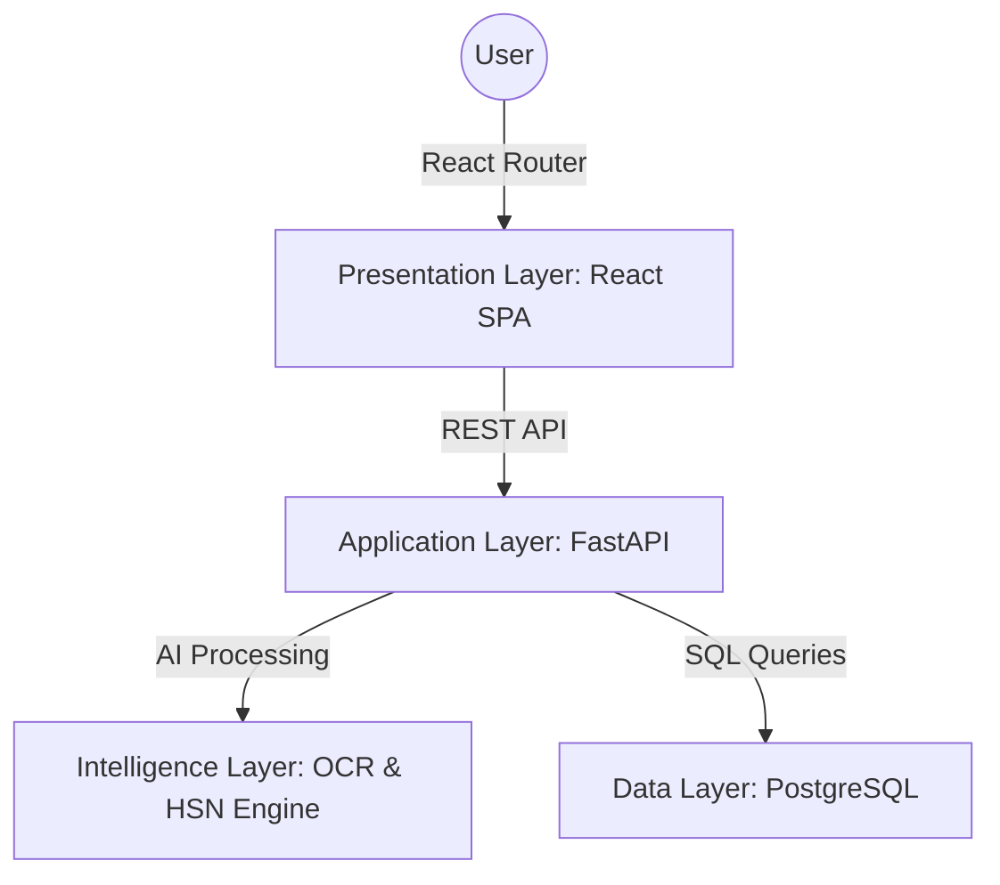

# Shnoor Trade Intelligence
## Project Documentation
Developed By: Shnoor | Technology: React.js | FastAPI | Python | PostgreSQL | Tailwind CSS

### Abstract
This report documents Shnoor Trade Intelligence — a next-generation AI-powered logistics and trade compliance platform. The system is designed to replace manual supply chain tracking and customs classification with an autonomous digital platform. It covers everything from intelligent document extraction (OCR) and automated HSN code classification to global duty calculation, real-time risk analysis, and shipment tracking.

The application is built on a modern stack: a React.js (Vite) frontend for a responsive user interface, a high-performance FastAPI (Python) backend for API handling and business logic, an integrated AI Intelligence Engine for document parsing, and a PostgreSQL database (via SQLAlchemy) for persistent, isolated user data storage.

The goal of this project is to provide logistics professionals, importers, and exporters with a clean, centralized tool to manage their global supply chains. Every feature — from the automated risk scoring engine to the AI reasoning in product classification — was built based on the real-world complexities of modern international trade.

### 1. Introduction
Managing global trade and logistics is traditionally a fragmented and high-friction process. Tasks like extracting data from complex commercial invoices, determining accurate HSN classification codes, calculating landing costs, and monitoring carrier risks often lead to compliance errors and financial losses when done manually.

Shnoor Trade Intelligence was built to solve this. It is a full-stack, AI-integrated web application that brings all professional trade operations under one unified dashboard. The platform is designed for speed and accuracy, ensuring that logistics operators have a seamless, high-performance experience.

The system ensures complete data isolation through user sessions, meaning every company's supply chain data remains strictly confidential.

### 2. Objectives
The main objectives of this project are:
* To build a centralized ecosystem where professionals can manage their entire import/export lifecycle in one place.
* To automate trade compliance through an AI-driven Document Intelligence (OCR) engine.
* To provide instant HSN classification and global duty calculation to estimate landing costs accurately.
* To implement a real-time Risk Analysis system that evaluates entities, vendors, and trade routes.
* To offer clear data visualization through analytical dashboards and financial ledgers.
* To ensure secure and scalable data handling using protected API routes and a relational database.

### 3. Technology Stack
**Frontend**
* **React.js (Vite)**: Used as the core library for building a fast, component-based Single Page Application (SPA).
* **React Router DOM**: Handles dynamic routing and secure access.
* **Axios / Fetch API**: Manages all asynchronous HTTP requests between the frontend and the FastAPI backend.
* **Tailwind CSS**: Utility-first CSS framework for premium, high-density enterprise styling.
* **Framer Motion**: Provides smooth micro-animations and seamless page transitions.
* **Lucide React**: Provides a comprehensive library of sleek, modern icons.

**Backend**
* **FastAPI (Python)**: High-performance asynchronous web framework used to define API routes and connect AI logic.
* **SQLAlchemy**: Robust Object-Relational Mapper (ORM) used for secure database management.
* **Pydantic**: Enforces strict data validation and schema management.
* **FastAPI Mail**: Manages automated email communications (Contact forms, password resets) via SMTP.

**AI Engine & Database**
* **Python Intelligence Layer**: Custom OCR and HSN classification engines.
* **PostgreSQL**: The robust relational database used to store all platform data with full integrity.
* **JSON/Memory Storage**: Used for local fast-lookup tables like HSN databases and duty rate charts.

### 4. System Architecture
Shnoor Trade Intelligence follows a modern architecture with an embedded AI Intelligence Layer:

* **Presentation Layer (Frontend)**: The User Interface. It connects to the backend through REST API calls. Private dashboards are restricted to authenticated sessions.
* **Application Layer (Backend)**: Handles the business logic and user data isolation. Every request validates the `user_id` to ensure absolute privacy.
* **Intelligence Layer (AI Engine)**: Processes complex unstructured data like PDF invoices, runs rule-based risk calculations, and performs natural language classification for HSN codes.
* **Data Layer (Database)**: Stores all persistent records (Users, Shipments, Documents) in structured tables to ensure data consistency.

### 5. Project Structure
**Frontend Organization (`src/`)**
* **Components (`src/components/`)**: Reusable UI elements like `Navbar.jsx`, `Sidebar.jsx`, and `Footer.jsx`.
* **Pages (`src/pages/`)**: Organized into public pages (`LandingPage.jsx`, `HowItWorks.jsx`) and private dashboard modules (`Analytics.jsx`, `Ledger.jsx`, `DocumentIntelligence.jsx`).
* **API Utilities (`src/api.js`)**: A central utility configuring backend communication and enforcing the User Context across all requests.

**Backend Organization (`backend/`)**
* **Core API & Database**: `main.py` defines the FastAPI application and routes. `database.py` handles the PostgreSQL connection pool.
* **Data Models**: `models.py` defines the SQLAlchemy ORM schemas, and `pydantic_models.py` enforces strict request validation.
* **Intelligence Logic**: `ocr_engine.py` processes unstructured invoice data, and `hsn_engine.py` performs AI product classification.
* **Trade Datasets**: `trade_constants.py` stores critical dictionaries for country risk and global duty calculations.

### 6. Modules and Features
**6.1 Authentication Module**
Handles secure entry into the private dashboard.
* **Secure Access**: Login and Registration workflows that initialize a secure user session.
* **Password Recovery**: A robust forgotten password flow utilizing automated emails with unique reset tokens.

**6.2 Public Facing Modules**
* **Landing & Features**: Introduces the platform's value proposition with a premium "Glassmorphic" design.
* **Contact Integration**: Allows potential clients to send secure inquiries directly to the administrative team.

**6.3 Intelligence Dashboard (Core Modules)**
* **Document Intelligence**: Upload hub for shipping bills and invoices. Uses OCR to extract line items and vendors.
* **HSN Search**: AI classification tool. Users describe a product, and the AI determines the precise global HSN code.
* **Duty Calculator**: Calculates total landing costs across different countries based on real-time tax rules.
* **Risk Analysis**: Evaluates entities and trade routes, assigning a Trust Score and flagging potential compliance risks.
* **Shipment Tracking & Ledger**: Visualizes active sea/air/land freight and tracks all extracted payables.

### 7. Database Design
The platform uses PostgreSQL with a relational schema defined via SQLAlchemy.

* **users**: Stores account data (email, full name, hashed password, role).
* **shipments**: Tracks active logistics containers (carrier, origin, destination, ETA, status). Linked to a specific `user_id`.
* **documents**: Stores records of uploaded invoices and bills. Contains the raw `extracted_data` (JSONB) and `payment_status`. Linked to `shipments`.
* **hsn_results**: Logs historical AI classifications (product description, assigned code, confidence score).
* **duties**: Records historical tax calculations for auditing.
* **risk_alerts**: Stores risk evaluations for specific vendors or entities, including trust scores and security messages.

### 8. Detailed API Documentation
**Public & Auth Routes**
* `POST /register`: Creates a new user account.
* `POST /login`: Authenticates credentials and returns user session data.
* `POST /contact`: Triggers a platform email to administrators.
* `POST /forgot-password`: Generates and sends a password reset link.
* `POST /reset-password`: Updates the user's password securely.

**Intelligence Routes**
* `POST /documents`: Uploads a file and runs the AI OCR extraction engine.
* `GET /documents`: Fetches all processed documents for the current user.
* `POST /documents/{id}/approve`: Commits extracted data to the ledger, generates a risk score, and initiates a shipment.
* `PATCH /documents/{id}/payment`: Updates the financial status of a document (e.g., Paid, Overdue).
* `POST /hsn`: Submits a product description for AI classification.
* `POST /duty`: Calculates basic and additional tax based on value, destination, and code.

**Dashboard Routes**
* `GET /shipments`: Retrieves all active freight movements.
* `GET /risk`: Fetches trust scores and risk alerts for vendors.
* `GET /analytics`: Aggregates trade volume, duty savings, and monthly metrics.

### 9. System Workflows
The platform operational logic centers on turning unstructured trade documents into actionable intelligence.

**Step 1: Secure Onboarding**
Users register and log in. The system strictly isolates their data. From this point on, every API call attaches their `user_id` to ensure they only see their own company's supply chain.

**Step 2: Intelligent Data Extraction**
A user uploads an invoice via the Document Intelligence hub. The FastAPI backend receives the file and passes it to the `ocr_engine.py`. The engine reads the text, identifies the vendor, extracts line items, and returns a structured JSON payload to the frontend.

**Step 3: Risk Assessment & Approval**
The user reviews the AI-extracted data. When they click "Approve", the backend triggers the Risk Engine. It calculates a Trust Score based on the origin country, destination country, and vendor payment history. A new active `Shipment` is then created automatically.

**Step 4: AI Compliance & Duty Calculation**
To clear customs, the user inputs a product description into the HSN Search. The AI Engine provides the correct global code. The user then passes this code and the invoice value to the Duty Calculator, which references the `trade_constants.py` tables to generate exact tax obligations.

**Step 5: Ledger & Shipment Tracking**
The approved document appears in the Financial Ledger. Users can track its payment status (Unpaid -> Paid). Meanwhile, the active shipment appears on the global Tracking map, showing the ETA and transit progress.

### 10. Project File Manifest
**Root Directory**
* `Project_Documentation.md` — The primary technical report and operational documentation.
* `README.md` — Developer-focused overview.

**Backend Module (`backend/`)**
* `main.py` — The central FastAPI application; defines all API endpoints and connects modules.
* `models.py` — SQLAlchemy ORM schemas mapping Python classes to PostgreSQL tables.
* `pydantic_models.py` — Strict data validation structures for incoming API requests.
* `database.py` — Handles the secure connection pool for the database.
* `ocr_engine.py` — The core logic for extracting structured data from uploaded invoices.
* `hsn_engine.py` — The AI classification script for mapping product descriptions to harmonized codes.
* `trade_constants.py` — Stored dictionaries containing global duty rates and country risk profiles.
* `hsn_database.json` — Local memory store of valid international HSN codes.

**Frontend Module (`frontend/`)**
* `src/main.jsx` & `src/App.jsx` — Bootstraps the React application and defines global routing.
* `src/api.js` — The core utility managing all API requests and injecting the active user session.
* `src/index.css` & `src/App.css` — Tailwind CSS imports and global styling definitions.
* `src/components/Navbar.jsx` & `src/components/Sidebar.jsx` — Primary navigation layouts for the application.

*Application Pages (`src/pages/`)*
* `About.jsx` — Tells the story of Shnoor’s mission to simplify global trade.
* `Analytics.jsx` — A business intelligence portal providing monthly trade volume and duty savings charts.
* `Contact.jsx` — A functional inquiry page allowing potential clients to send messages to the admin team.
* `DashboardHome.jsx` — The personalized nerve center displaying high-level metrics and active alerts.
* `DocumentIntelligence.jsx` — The AI hub for uploading shipping bills, extracting data, and approving it into the tracking system.
* `DutyCalculator.jsx` — A global tax engine to calculate basic and additional landing costs.
* `Features.jsx` — A public deep-dive showcasing the technical capabilities of the platform.
* `ForgotPassword.jsx` — Initiates the secure password recovery flow via automated emails.
* `HSNSearch.jsx` — An AI classification tool that maps product descriptions to precise international HSN codes.
* `HowItWorks.jsx` — A step-by-step visual guide explaining the 4-stage data extraction process.
* `LandingPage.jsx` — The main public entry point featuring the value proposition and core CTAs.
* `Ledger.jsx` — The Financial Accounts Payable view, tracking invoice transactions and payment statuses.
* `Login.jsx` — The secure authentication portal that validates credentials and initiates user sessions.
* `Register.jsx` — Allows new clients to create an account and build their initial profile.
* `ResetPassword.jsx` — The final step in the account recovery process to set a new password.
* `RiskAnalysis.jsx` — A compliance oversight tool evaluating vendors and trade routes for security risks.
* `ShipmentTracking.jsx` — A tracking view showing the real-time status, ETAs, and transit progress of active freight.
